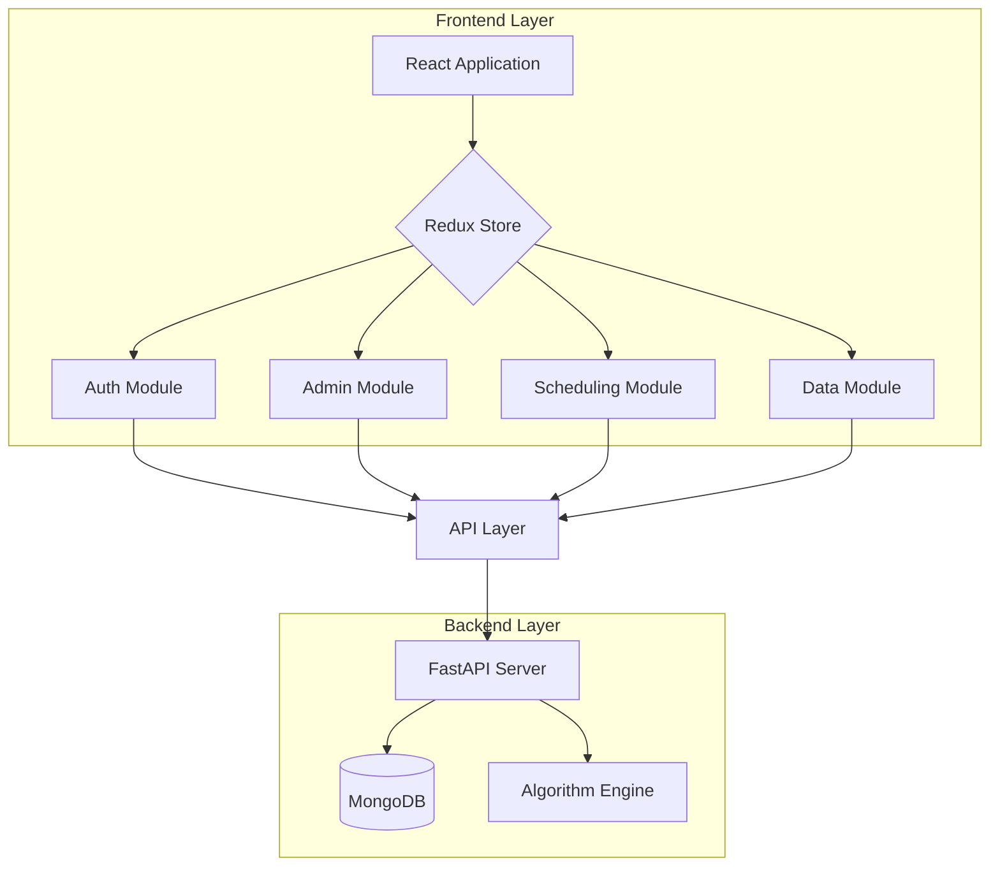
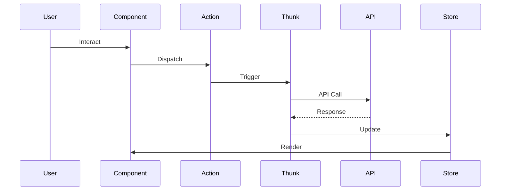

# Advanced Timetable Scheduling System

## 📚 Project Overview
An intelligent university timetable scheduling system built with modern web technologies, featuring advanced algorithms and real-time scheduling capabilities.

## 🏗 System Architecture

### High-Level Architecture


## 👥 Team Structure

- **Authentication & RBAC**: [Weerasinghe K.D.E.I - IT21259852](https://github.com/EasaraWeerasinghe)


## 🛠 Technical Stack

### Frontend Technologies
- **Core Framework:** React 18 with Vite
- **State Management:** Redux Toolkit
- **UI Components:** Ant Design
- **Styling:** Tailwind CSS
- **HTTP Client:** Axios
- **Routing:** React Router v6

### Development Tools
- **Build Tool:** Vite
- **Code Quality:** ESLint + Prettier
- **Testing:** Jest + RTL
- **Version Control:** Git

## 🔄 State Management Flow


## 🚀 Getting Started

### Prerequisites
- Node.js >= 16
- npm >= 8

### Installation
```bash
# Install dependencies
pnpm install

# Start development
pnpm run dev

# Build project
npm run build
```

## 🔒 Security Features

- JWT Authentication
- Role-based Access
- Input Validation
- XSS Prevention
- CSRF Protection

## 🧪 Testing Strategy

### Test Coverage
- Unit Tests
- Integration Tests
- E2E Tests
- Performance Tests

## 📈 Performance Optimization

- Code Splitting
- Lazy Loading
- Memoization
- State Optimization
- Bundle Size Management


## 📝 License
MIT License

